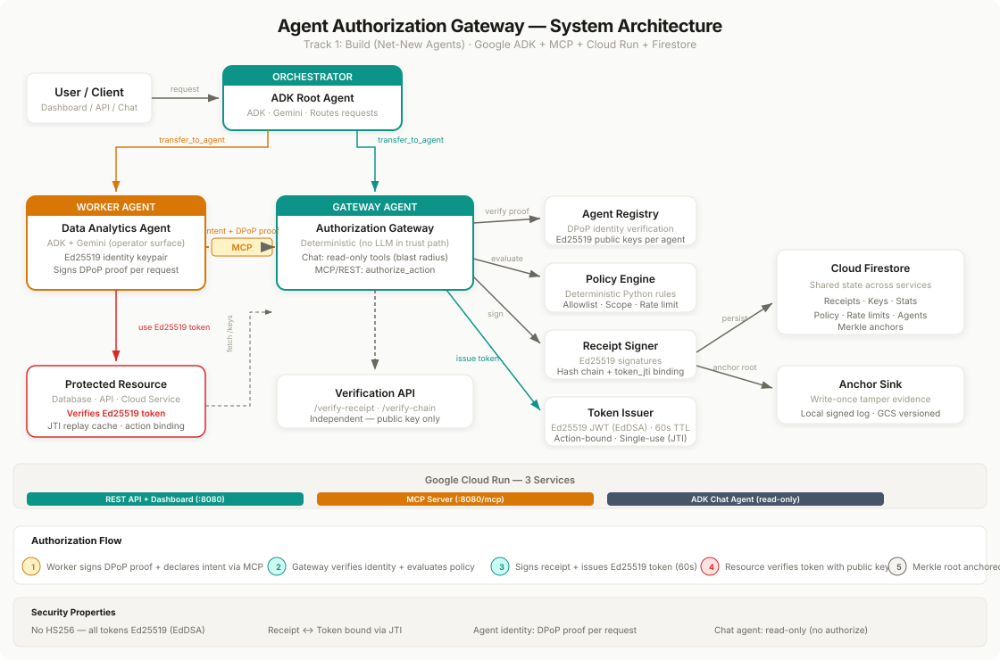

# Agent Authorization Gateway

An open protocol and reference implementation for cryptographic proof of every AI agent action.

**Google for Startups AI Agents Challenge — Track 1: Build (Net-New Agents)**

## The Problem

AI agents are the fastest-growing category of Non-Human Identity (NHI). OWASP's NHI Top 10 identifies overprivileged NHIs and long-lived secrets as critical risks. Today, when an agent calls a cloud API, accesses a database, or invokes a tool:

- No policy evaluation before the action executes
- No cryptographic proof that authorization occurred
- No tamper-evident audit trail independent of the agent itself
- No way to revoke access if the agent drifts from its intent

If an agent is compromised or hallucinates a dangerous action, existing frameworks have no enforcement boundary — the agent's credentials work regardless.

## What's Different

| Dimension | Typical agent auth | This project |
|-----------|-------------------|--------------|
| **Enforcement** | Advisory — policy returns a decision, nothing prevents bypass | Mandatory — no Ed25519 token = resource rejects the request |
| **Audit trail** | Append-only logs (mutable by operator) | Ed25519-signed receipts, hash-chained, Merkle-anchored |
| **Token model** | Long-lived API keys or OAuth tokens | 60-second, single-use, action-bound Ed25519 JWTs |
| **Agent identity** | Self-declared agent_id string | DPoP-style proof of possession (Ed25519 keypair per agent) |
| **Verification** | Trust the auth server | Anyone with the public key can verify independently |
| **Framework lock-in** | Framework-specific | MCP server — works with ADK, LangChain, CrewAI, any MCP client |

### vs. Related Projects

| | Agent Authorization Gateway | [agentgateway](https://github.com/agentgateway/agentgateway) | [better-auth agent-auth](https://github.com/nicnocquee/agent-auth-protocol) | MCP Gateway Registry |
|---|---|---|---|---|
| Per-action signed receipts | Yes (Ed25519) | No | No | No |
| Hash-chained audit trail | Yes | No | No | No |
| Merkle anchoring | Yes (RFC 6962) | No | No | No |
| Independent verification | Yes (public key only) | No | No | No |
| Token format | Ed25519 JWT (60s, action-bound) | — | Bearer token | — |
| Agent identity binding | DPoP-style proof | — | — | — |
| Open protocol spec | Yes (docs/protocol.md) | No | Draft | No |

## Architecture

[](docs/architecture.svg)

```
                          MCP / REST
 ┌─────────────────┐    (+ DPoP proof)     ┌──────────────────────────┐
 │  Worker Agent   │ ───────────────────> │  Authorization Gateway   │
 │  (ADK/LangChain │  1. register identity │  (Gemini + ADK)          │
 │   /CrewAI/any)  │  2. sign DPoP proof   │                          │
 │                 │  3. declare intent    │  ┌ Agent Registry        │
 │  Ed25519 keypair│ <─────────────────── │  │  (DPoP verification)  │
 │  per agent      │  4. Ed25519 token     │  ├ Policy Engine         │
 │                 │     + signed receipt  │  │  (allowlist/scope/    │
 └────────┬────────┘     (token_jti bound) │  │   rate limit)         │
          │                                │  ├ Receipt Signer        │
          │  5. use Ed25519 token           │  │  (Ed25519 + hash      │
          │     (60s, single-use,          │  │   chain + Merkle)     │
          │      action-bound)             │  ├ Token Issuer          │
          v                                │  │  (Ed25519 JWT, 60s)   │
 ┌─────────────────┐                       │  └ Anchor Sink           │
 │ Protected       │                       │    (signed log / GCS)    │
 │ Resource        │  fetch /keys          └────────────┬─────────────┘
 │                 │ ·····················>              │
 │ Verifies token: │                          ┌─────────┴──────────┐
 │  • Ed25519 sig  │                          │  Cloud Firestore   │
 │  • action_digest│                          │                    │
 │  • JTI replay   │                          │  Receipts · Keys   │
 │  • expiry       │                          │  Policy · Stats    │
 └─────────────────┘                          │  Anchors · Agents  │
                                              └────────────────────┘

 Cloud Run Services:
 ┌──────────────────┐ ┌──────────────────┐ ┌──────────────────┐
 │ REST API +       │ │ MCP Server       │ │ ADK Chat Agent   │
 │ Dashboard        │ │ (authorize,      │ │ (read-only tools │
 │ (all endpoints)  │ │  verify, keys)   │ │  blast radius)   │
 └──────────────────┘ └──────────────────┘ └──────────────────┘
```

**[View full interactive diagram →](docs/architecture.svg)**

## The Receipt Chain Verification Protocol

Every authorization decision produces a signed receipt:

```json
{
  "body": {
    "v": "1", "tenant": "hackathon-demo", "seq": "4",
    "ts": "2026-05-28T00:23:52Z",
    "request_digest": "sha256:ff39ad...",
    "policy_version": "sha256:d59a1e...",
    "decision": "approve", "reasons": [],
    "prev_receipt": "sha256:c8e4bb...",
    "token_jti": "1b77f364-..."
  },
  "sig": { "alg": "EdDSA", "kid": "gateway-...", "value": "HIEMRy..." },
  "receipt_hash": "sha256:89ff1e..."
}
```

Each receipt links to the previous via `prev_receipt`, forming an unbroken hash chain from genesis. Receipts are anchored in a Merkle tree (RFC 6962) and written to an append-only anchor sink.

Full specification: [docs/protocol.md](docs/protocol.md)

## Quick Start

```bash
git clone https://github.com/4KInc/agent-authorization-gateway.git
cd agent-authorization-gateway
python -m venv .venv && source .venv/bin/activate
pip install -e ".[dev]"
cp .env.example .env  # add GOOGLE_API_KEY for ADK agent
```

### Run locally

```bash
python serve.py           # REST API + Dashboard → http://localhost:8080
python serve_mcp.py       # MCP server → http://localhost:8090/mcp
adk web authorization_gateway  # ADK chat → http://localhost:8000
```

### Run tests

```bash
pytest tests/ -v   # 101 tests
```

### Run the full demo

```bash
./examples/demo/run_demo.sh   # Gateway + Resource + Compliant Worker + Rogue Worker + Tamper Demo
```

### Deploy to Cloud Run

```bash
gcloud builds submit --tag us-central1-docker.pkg.dev/PROJECT/repo/image:latest
gcloud run deploy agent-auth-gateway --image ... --allow-unauthenticated \
  --set-env-vars="FIRESTORE_ENABLED=true,GOOGLE_CLOUD_PROJECT=PROJECT"
```

## Demo

The demo proves three things:

1. **Compliant Worker:** Registers identity → authorizes via MCP → uses token → action succeeds
2. **Rogue Worker:** 4 attacks (no token, forged, expired, wrong-action) → all blocked with specific 401 codes
3. **Tamper Detection:** Modify a stored receipt → chain verification detects the exact receipt and field

Run `./examples/demo/run_demo.sh` to see the full demo locally.

## Live URLs

| Service | URL |
|---------|-----|
| REST API + Dashboard | https://agent-auth-gateway-1031148889398.us-central1.run.app |
| MCP Server | https://agent-auth-gateway-mcp-1031148889398.us-central1.run.app/mcp |
| ADK Chat Agent | https://agent-auth-gateway-adk-1031148889398.us-central1.run.app |

## Security Model

See [SECURITY.md](SECURITY.md) for the full threat model, including:
- 7 threats the Gateway defends against
- 6 threats it explicitly does NOT defend against
- Trust assumptions for tamper-evidence
- LLM blast radius containment (chat agent has read-only tools)
- Cryptographic choices table

## Documentation

| Document | Description |
|----------|-------------|
| [SECURITY.md](SECURITY.md) | Threat model and security boundaries |
| [docs/protocol.md](docs/protocol.md) | Receipt Chain Verification Protocol v0.1 |
| [docs/policy.md](docs/policy.md) | Policy engine: rule types, examples, failure modes |
| [NAMING.md](NAMING.md) | Disambiguation from agentgateway project |

## Built With

- [Google ADK](https://github.com/google/adk-python) 2.1 — multi-agent orchestration
- [Gemini 2.5 Flash](https://ai.google.dev/) — agent reasoning + Google Search grounding
- [MCP](https://modelcontextprotocol.io/) — framework-agnostic tool integration
- [Cloud Run](https://cloud.google.com/run) — serverless deployment (3 services)
- [Cloud Firestore](https://cloud.google.com/firestore) — receipt chain persistence
- Ed25519 / SHA-256 / RFC 8785 / RFC 6962 — cryptographic foundations

## License

Apache-2.0
